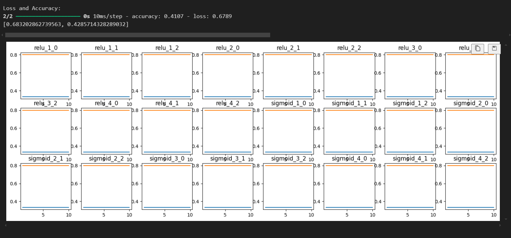

# Stock Predictions (Sell Or Buy)

## Website: 
[website](https://github.com/Damiomo/Stock-Predictions)

## Description
In this prject I did data model implementation by using python script, initialized, trained, and evaluated multiple models.  Cleaned, normalized, and standardized data prior to modeling.  The model utilized data retrieved from SQLite.  Some data model optimization was done with the evaluation of different models.  Displayed model optimization and evaluation process and iterative changes made to the model and the resulting changes in model performance in a few line charts.  The overall model performance was printed for each model.

## Table of Contents
- [Installation](#installation)
- [Usage](#usage)
- [Credits](#credits)
- [License](#license)
- [Features](#features)

- [Contact](#contact)

## Installation
slqlite3, pandas, yfinance, numpy, LinearRegression, Sequential, Input, Dense, SimpleRNN, GridSearchCV, train_test_split

## Usage
run ETL.ipnb and Model_Research.ipynb

## Credits
Damilare Omboriowo

## License
MIT

## Features
It provide a chart with 24 neural network evaluations

## Contact
If there are any questions or concerns, I can be reached at:
##### [github: Damiomo](https://github.com/Damiomo)
##### [email: Domoboriowo14@Gmail.com](mailto:Domoboriowo14@Gmail.com)
